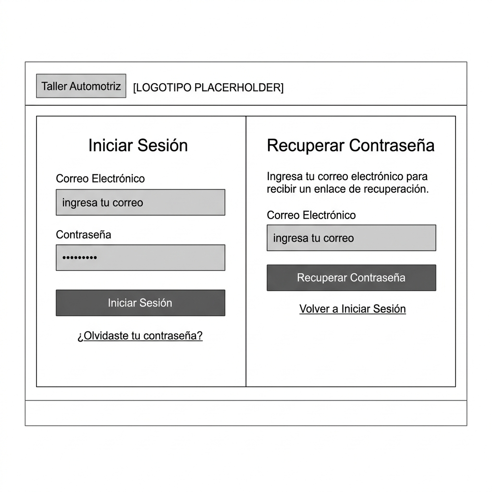
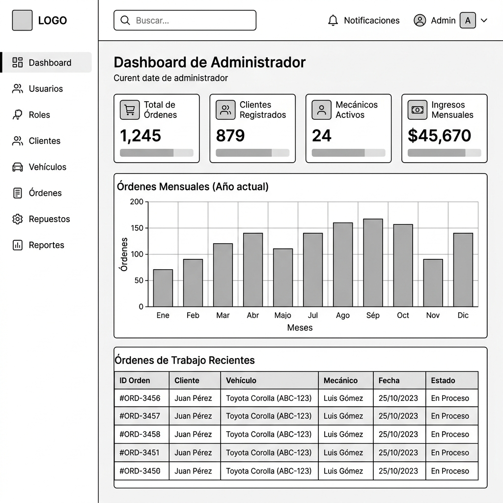
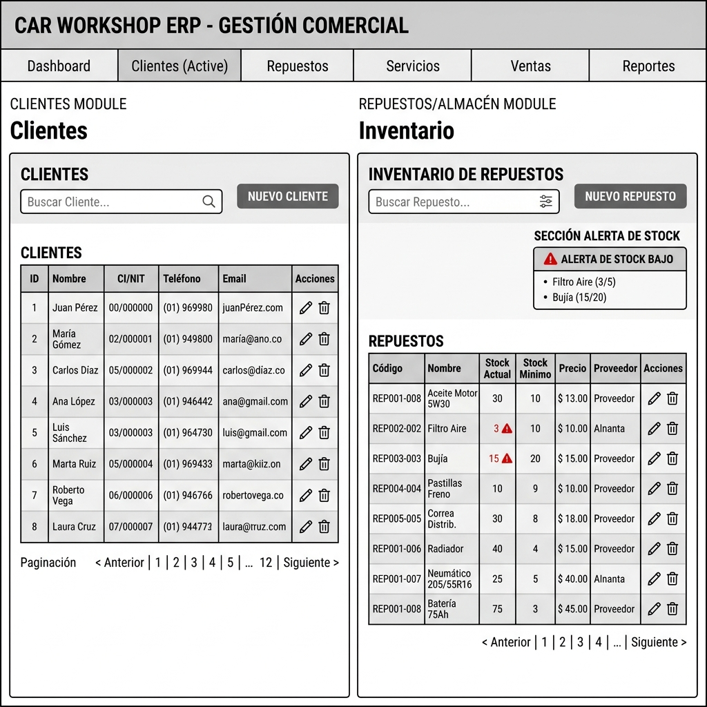
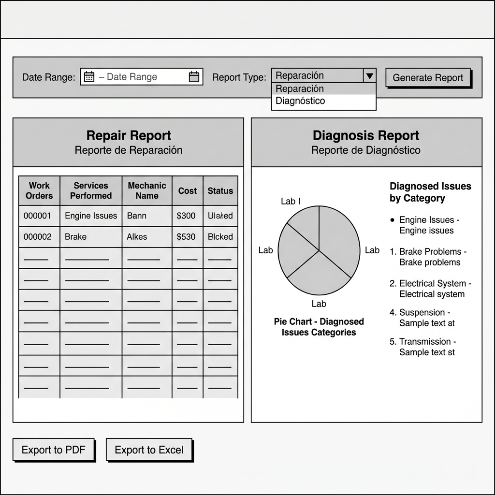
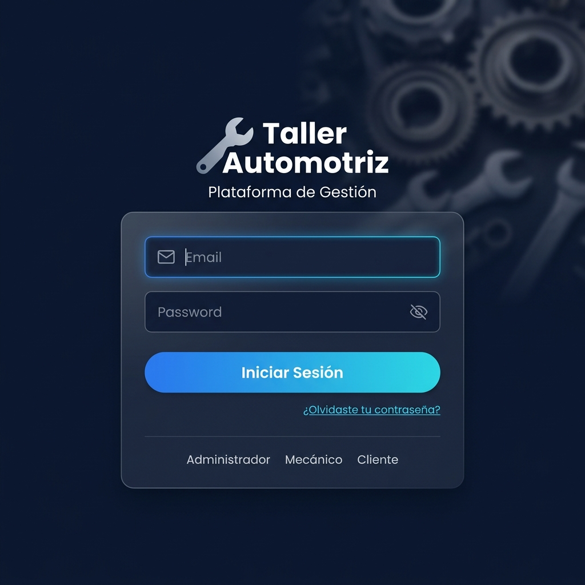
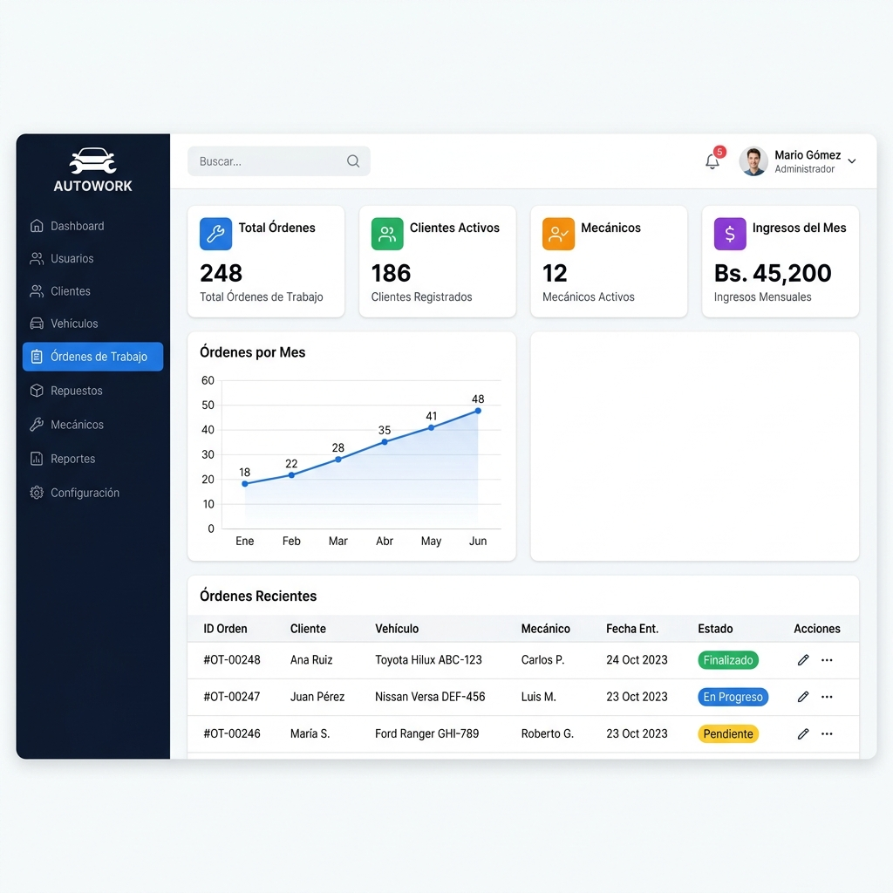
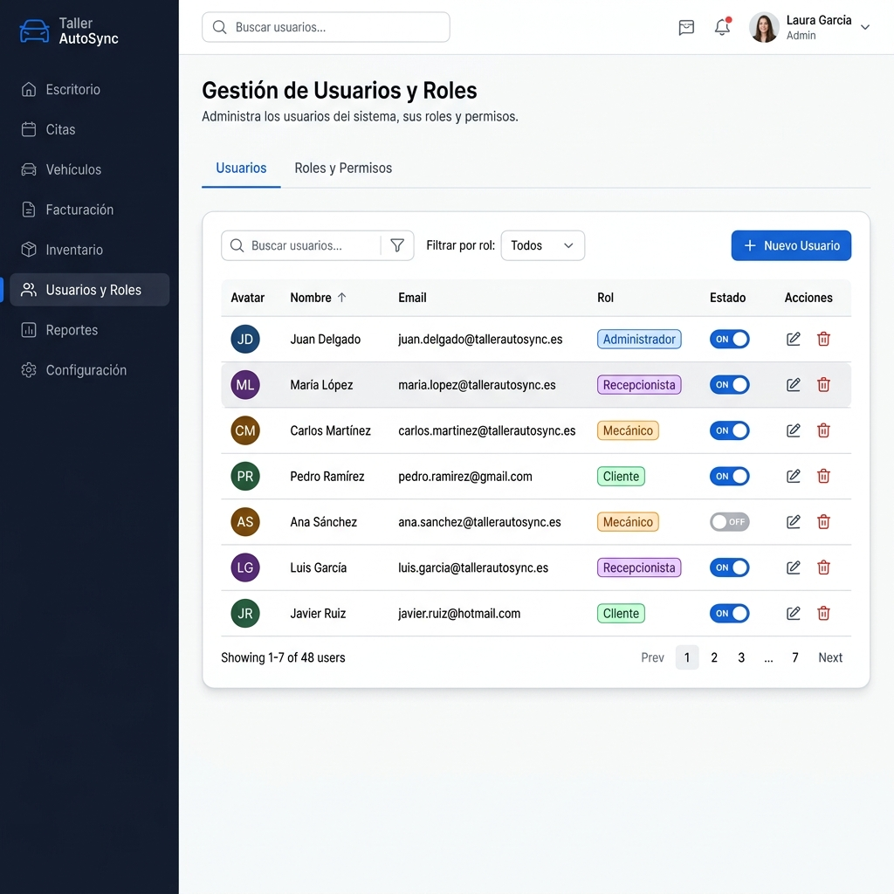
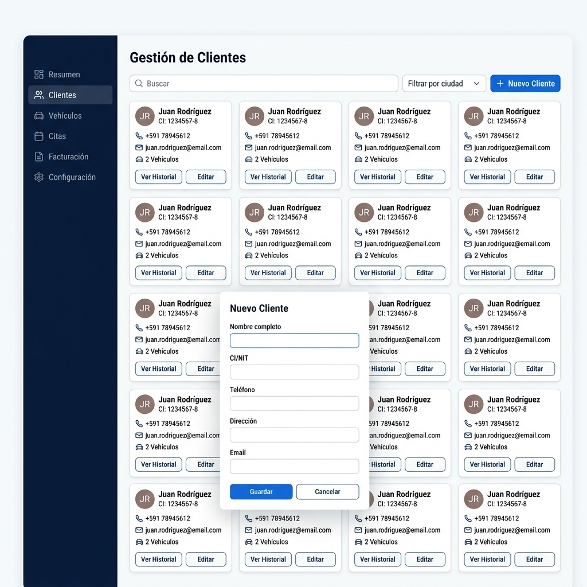

# 🔧 Plataforma Web para Taller Automotriz
### Grupo Los Jausis — Universidad Privada Domingo Savio

> **Materia:** Programación Web II  
> **Docente:** Melgar Zabala Paul Mauricio  
> **Carrera:** Ingeniería en Sistemas

---

## 👥 Integrantes

| # | Nombre |
|---|--------|
| 1 | Luis Fernando Felipe Salvatierra Manaca |
| 2 | Luis Fernando Hurtado |

---

## 📋 Descripción del Proyecto

Plataforma web para la gestión integral de servicios y clientes de talleres automotrices en Santa Cruz de la Sierra. El sistema contempla módulos de seguridad, administración, gestión comercial, mecánicos, repuestos, pagos y reportes.

---

## 🔗 Repositorio

[https://github.com/fernandof777/programacion_web_2](https://github.com/fernandof777/programacion_web_2)

---

## 🖼️ Wireframes & Mockups — Actividad 4

> **Mínimo requerido:** 2 Wireframes + 2 Mockups por integrante  
> **Total entregado:** 4 Wireframes + 4 Mockups

---

## 📐 WIREFRAMES

Los wireframes representan la estructura y distribución de elementos en pantalla, sin colores ni estilos finales.

---

### Wireframe 1 — Seguridad: Login & Recuperación de Contraseña
*Integrante: Luis Fernando Felipe Salvatierra Manaca*



**Pantallas incluidas:**
- Formulario de inicio de sesión (email, contraseña, botón Iniciar Sesión)
- Enlace de recuperación de contraseña
- Formulario de recuperación (ingreso de email registrado)

---

### Wireframe 2 — Administración: Dashboard
*Integrante: Luis Fernando Felipe Salvatierra Manaca*



**Pantallas incluidas:**
- Barra de navegación superior con logo y menú de usuario
- Sidebar con menú completo del sistema
- Tarjetas de métricas KPI (órdenes, clientes, mecánicos, ingresos)
- Gráfico de barras de órdenes mensuales
- Tabla de órdenes de trabajo recientes

---

### Wireframe 3 — Gestión Comercial: Clientes & Repuestos/Almacén
*Integrante: Luis Fernando Hurtado*



**Pantallas incluidas:**
- Módulo Clientes: tabla con ID, Nombre, CI/NIT, Teléfono, Email, Acciones
- Botón "Nuevo Cliente" y barra de búsqueda
- Módulo Repuestos/Almacén: tabla de inventario con Código, Stock, Precio, Proveedor
- Sección de alertas de stock mínimo

---

### Wireframe 4 — Reportes: Reparación & Diagnóstico
*Integrante: Luis Fernando Hurtado*



**Pantallas incluidas:**
- Filtros por rango de fechas y tipo de reporte
- Tabla de Reporte de Reparación con órdenes, servicios y costos
- Sección de Reporte de Diagnóstico con gráfico de torta y listado por categoría
- Botones de exportación a PDF y Excel

---

## 🎨 MOCKUPS

Los mockups representan el diseño visual final de la aplicación con colores, tipografía e interacciones reales.

---

### Mockup 1 — Seguridad: Pantalla de Login
*Integrante: Luis Fernando Felipe Salvatierra Manaca*



**Características de diseño:**
- Tema oscuro con fondo azul marino profundo (#0F172A)
- Tarjeta central con efecto glassmorphism
- Campos de email y contraseña con iconos y validación visual
- Botón "Iniciar Sesión" con gradiente azul-cyan
- Enlace de recuperación de contraseña en azul claro
- Indicadores de rol de acceso (Administrador, Mecánico, Cliente)

---

### Mockup 2 — Administración: Dashboard Principal
*Integrante: Luis Fernando Felipe Salvatierra Manaca*



**Características de diseño:**
- Sidebar oscuro (#0F172A) con íconos de navegación
- Ítem activo resaltado en azul
- 4 tarjetas KPI con colores diferenciados (azul, verde, naranja, morado)
- Gráfico de línea "Órdenes por Mes" en azul
- Tabla de órdenes recientes con badges de estado coloreados
- Diseño responsivo y profesional

---

### Mockup 3 — Administración: Gestión de Usuarios & Roles
*Integrante: Luis Fernando Hurtado*



**Características de diseño:**
- Tabla de usuarios con avatar, nombre, email y rol
- Badges de rol con colores: Administrador (azul), Mecánico (naranja), Cliente (verde), Recepcionista (morado)
- Toggle de estado Activo/Inactivo
- Botones de acción (editar, eliminar) por fila
- Barra de búsqueda y filtros avanzados

---

### Mockup 4 — Gestión Comercial: Clientes
*Integrante: Luis Fernando Hurtado*



**Características de diseño:**
- Grid de tarjetas de clientes con avatar circular e iniciales
- Datos del cliente: nombre, CI/NIT, teléfono, email, vehículos asociados
- Botones de acción: "Ver Historial" y "Editar"
- Modal de formulario "Nuevo Cliente" con campos validados
- Buscador y filtro por ciudad

---

## 🏗️ Tecnologías Utilizadas

- **Framework:** Laravel 13
- **Base de datos:** SQLite
- **Frontend:** Blade Templates + Tailwind CSS v4 + Vite
- **Control de versiones:** Git + GitHub

---

## ⚙️ Instalación Local

```bash
# Clonar el repositorio
git clone https://github.com/fernandof777/programacion_web_2.git
cd programacion_web_2

# Instalar dependencias PHP
composer install

# Configurar variables de entorno
cp .env.example .env
php artisan key:generate

# Crear base de datos y ejecutar migraciones
php artisan migrate

# Instalar dependencias JS y compilar assets
npm install
npm run build

# Iniciar servidor de desarrollo
php artisan serve
```

---

## 📁 Estructura del Proyecto

```
Proyecto/
├── app/
│   ├── Http/Controllers/
│   ├── Models/
│   └── Providers/
├── database/
│   └── migrations/
├── public/
│   └── img/
│       ├── wireframes/       ← Wireframes de la Actividad 4
│       └── mockups/          ← Mockups de la Actividad 4
├── resources/
│   └── views/
│       └── welcome.blade.php
└── routes/
    └── web.php
```

---

*Universidad Privada Domingo Savio — Santa Cruz de la Sierra, Bolivia*
